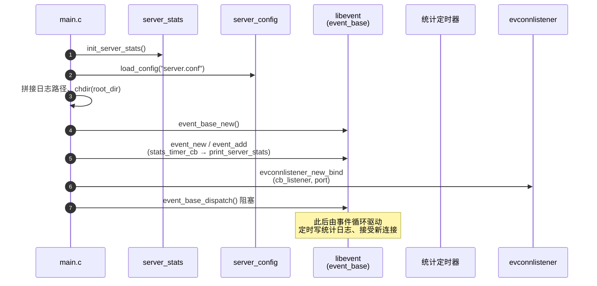
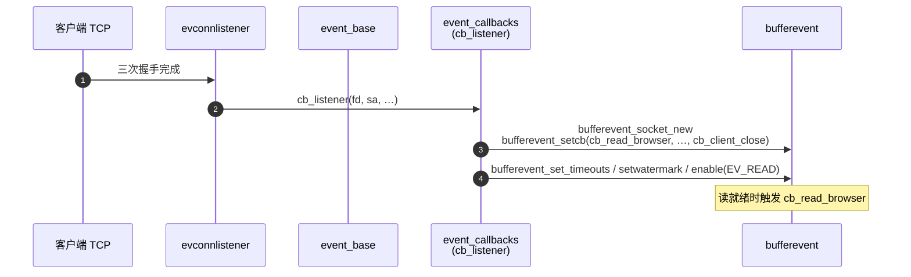
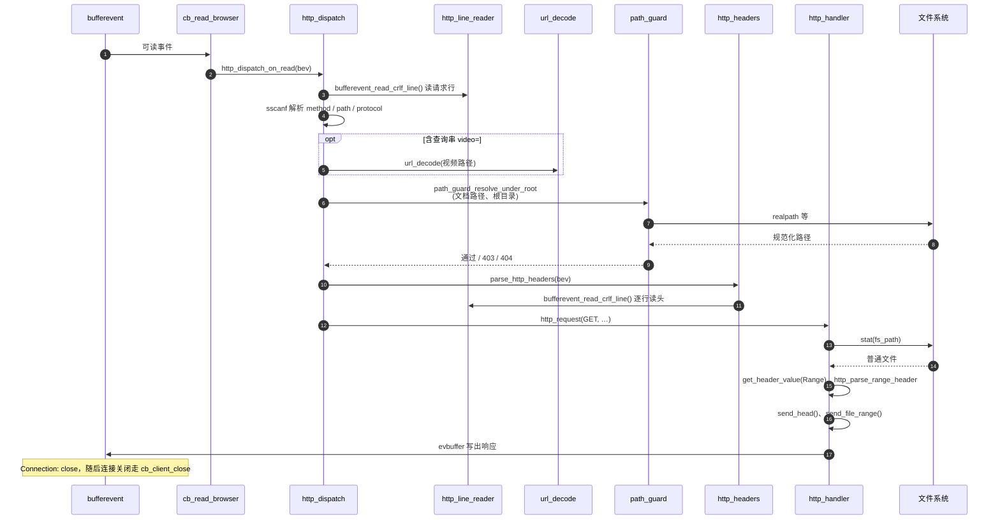
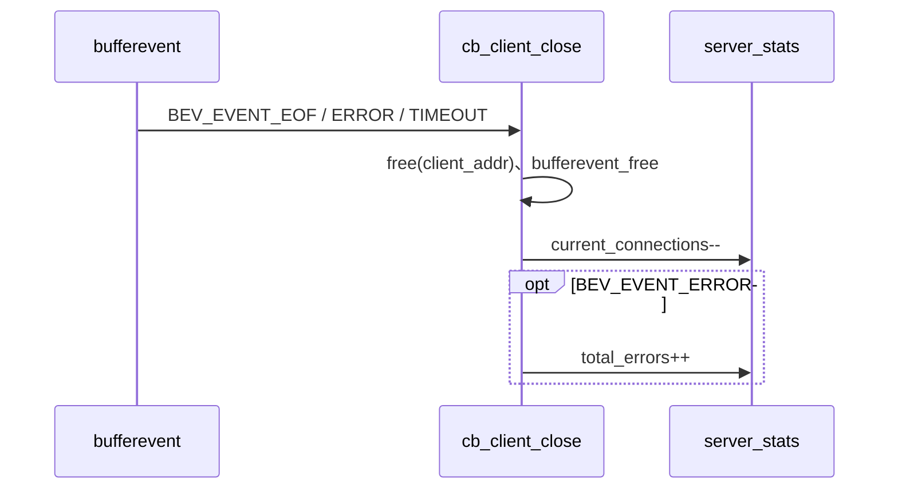

# 项目时序图

本文档用 [Mermaid](https://mermaid.js.org/) 描述 **服务启动** 与 **单次 HTTP 请求** 的主要调用顺序。在支持 Mermaid 的编辑器（如 VS Code、GitHub、GitLab）中可预览图形。

---

## 1. 服务启动

---

## 2. 新连接建立

---

## 3. 单次请求处理（以 GET 静态文件为例）

---

## 4. 连接关闭（示意）

---

## 说明

- **统计定时器**与请求处理在 **同一 `event_base`** 上异步交错执行，未单独画成交互，避免图形过于拥挤。
- **目录列表**、**仅请求行失败**、**非 GET** 等分支与上图主路径类似，仅在 `http_dispatch` / `http_request` 内提前返回或走 `send_error`、`send_dir`。
